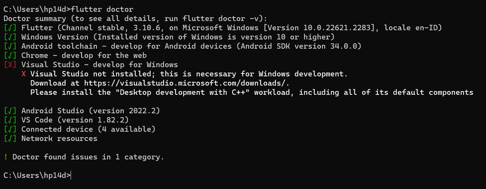
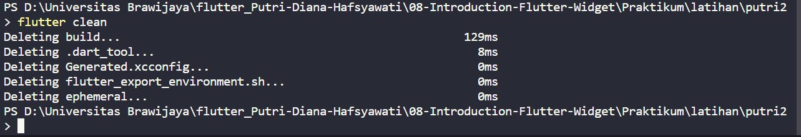
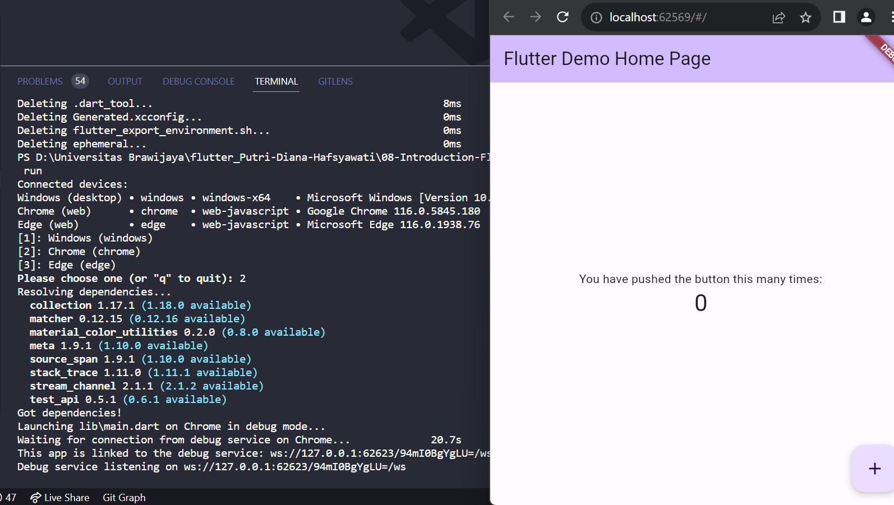

### FLUTTER COMMAND LINE INTERFACE & PACKAGE MANAGEMENT

### Flutter CLI
 Flutter CLI adalah alat yang digunakan untuk berinteraksi dengan Flutter SDK,

 ### Important CLI Commands
 1. Flutter Doctor
    
 2. Flutter Clean 
    
 3. Flutter Run 
    
 4. Flutter Emulator
 5. Flutter Create
 6. Flutter Channel
 7. Flutter Pub
 8. Flutter Build